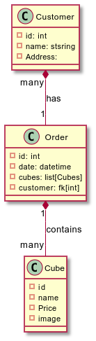

# CubeDave Website
## Aim
This is an exercise abount implementing a full stack website.
It contains: 
- backend with Flask
  - rendering tamplates using jinja
  - inheritage of a base template for other sites
- SQLAlchemy integration in Flask
  - Models for the shop
     - Products
     - Orders
     - Customer
- Frontend with JavaScript
  - loading content dinamically with AIAX
  

