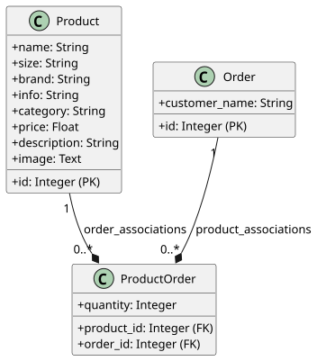

# CubeDave's Cube Shop – Web Engineering Full Stack

**Live:** https://cubedave.ch

---

# Project Description

CubeDave's Cube Shop is a small full-stack web application that demonstrates a modern web architecture using SvelteKit, FastAPI and Docker.  
The application provides a simple online shop where products can be browsed, managed via an admin interface, and ordered through a REST API.

---

# Architecture Overview

The goal of this architecture is to provide a lightweight full-stack web application with clear separation between frontend, backend and infrastructure.  
The system is designed to be easily deployable using Docker while keeping the technology stack simple and maintainable.

## Full-Stack Layers

```

Browser (SvelteKit)  
↓ HTTPS, statics and API  
Nginx (Reverse Proxy + SSL)  
↓ HTTP docker  
┌───────────────────┐  
│ Static files │ ← compiled Svelte build served by Nginx  
└───────────────────┘  
↓ /api/*  
FastAPI (Python, Uvicorn)  
↓ SQLAlchemy ORM  
SQLite (database.db)

```

## Technology Stack

| Layer            | Technology                 | Role                               |
| ---------------- | -------------------------- | ---------------------------------- |
| Frontend         | SvelteKit + Tailwind CSS 4 | UI, routing, design                |
| Backend          | FastAPI + Uvicorn          | API, ORM                           |
| ORM              | SQLAlchemy                 | connection to DB                   |
| Database         | SQLite                     | Persistence                        |
| Proxy            | Nginx + nginx-certbot      | SSL, reverse proxy, static serving |
| Containerisation | Docker + Docker Compose    | Deployment                         |


---

# Project Structure

**Backend**

```

app/  
├── main.py # FastAPI routes + startup seeding  
├── models.py # ORM models + Pydantic schemas  
├── database.py # Engine, session factory, db-connection  
├── test_main.py # test (pytest)  
├── Dockerfile # builds backend container  
├── docker-compose.yaml # Multi-service orchestration  
└── static/  
├── product.json # demodata  
└── product_default.json # restore demodata

```

**Frontend**
```
frontend/
├── Dockerfile              # Multi-stage: Node build → nginx-certbot
├── nginx.conf              # Reverse proxy + SSL config
├── svelte.config.js        # adapter-static, SPA fallback
└── src/
    ├── routes/
    │   ├── (main)/         # public shop
    │   │   ├── +page.svelte        # product list
    │   │   ├── product/
    │   │   │   └── [id]/+page.svelte   # detail view
    │   │   ├── shopping-cart/
    │   │   │   └── +page.svelte       # cart + checkout
    │   │   └── +layout.svelte         # layout für alle Seiten in (main)
    │   └── (admin)/        # admin area
    │       ├── product-list/
    │       │   └── +page.svelte
    │       ├── add-product/
    │       │   └── +page.svelte
    │       ├── update-product/
    │       │   └── +page.svelte
    │       ├── orders/
    │       │   └── [id]/+page.svelte
    │       └── +layout.svelte         # layout für alle Seiten in (admin)
    └── lib/
        ├── api.js             # fetch products
        ├── productsStore.js   # global product store + cache
        └── cartStore.js       # global cart store
```

---

# Technology

## Tailwind-CSS

Tailwind is a utility-first CSS framework, the look of this Website is customized by adding multiple classes to a HTML-tag -> no custom CSS classes needed.

example:  
`class="inline-block w-48 rounded bg-slate-600 px-4 py-2 text-right text-white"`

---

## Svelte
		
		## Advantages
		- simple: compile-time framework: ships no runtime, compiles to pure JS
		- **Svelte compiles to plain JavaScript – no framework runs in the browser.** React ships its own code (~40KB) that manages the DOM at runtime.
		
		## Svelte Runes
		
		Svelte uses Runes as reactive markers. As an effect content gets updated automatically.  
		These are the runes used in the project.
		
		| Rune       | Purpose             | Used in project                            |
		| ---------- | ------------------- | ------------------------------------------ |
		| `$state`   | reactive variable   | `cart`, `products`, `filter`, `quantities` |
		| `$derived` | computed from state | `filteredproduct` in shop page             |
		
		### `$state` example (cart.svelte.js)
		
		```python
		export const cart = $state([]); // reactive array, shared globally
		```
		
		---
		
		## Svelte Stores
		
		Usually variables stay within the scope of a page. To use the product-object on multiple pages it needs to be stored in a central place in `frontend/src/lib/`.  
		Exported from there it can then again be imported in all the pages where it is needed.
		
		---
		
		## SvelteKit Routing
		
		The Svelte-filesystem is used for routing (file-based routing). A folder containing a `+page.svelte` is automatically a route.  
		This page inherits from the `+layout.svelte`. So all the pages within the `(admin)` area have the same header and footer.
		
		The brackets `()` allow route groups, They are not visible in the url, but they allow tho have different layouts for different areas (admin and main have an own +layout.svelte) 
		
		A folder `[id]` is named dynamically. If the page gets called like `/api/shop/3`, the id would be 3 in this case.
		
		---
		
		# API & Web Protocols
		
		## Web Protocol
		
		- HTTP/HTTPS: request–response protocol
		- methods: GET (read), POST (create), PUT (full update), DELETE (remove)
		- no PATCH used → updates go through PUT with full object (`/api/update_product/{id}`)
		- status codes: 200 OK, 422 Unprocessable Entity (Pydantic validation fail)
		
		---
		
		## API Endpoints
		
		To view API endpoints navigate to [https://cubedave.ch/docs](https://cubedave.ch/docs)  
		Swagger lists all the endpoints.
		
		---
		
		# AJAX Loading
		
		## Concept
		
		This site uses asynchronous content loading. This means that page content like the shop products are being loaded and updated via API calls, and they arrive in JSON format.  
		Updating of the content is then done by Svelte.
		
		---
		
		## Implementation
		
		Every route starting with `/api/...` is connected with an API endpoint controlled by FastAPI.
		
		In Svelte there is the `onMount()` function which wraps the JavaScript `fetch()` and ensures loading before showing the page.  
		Products can also be fetched when clicking a button.
		
		---
		
		## Products Example
		
		```js
		// products.svelte.js
		export async function loadProducts() {
		  if (products.length === 0) {
		    // cache check
		    const data = await fetchProducts();
		    products.push(...data); // triggers re-render of all subscribers
		  }
		}
		```
		
		`loadProducts` is a wrapper of the `fetchProducts()` function.  
		It improves efficiency by only loading when needed.
		
		In order to refresh the product list after adding a new product, the list gets emptied by `invalidateProducts()`, then reloaded.
		
		---
		
		# Database & ORM
		
		## SQLAlchemy ORM
		
		In the backend the SQLAlchemy ORM takes care of the database functionality.
		
		---
		
		## Database Models
		
		
		---
		
		# Testing
		
		|Test|What it tests|
		|---|---|
		|`test_add_and_list_product`|POST product → appears in GET all|
		|`test_delete_product`|POST product → DELETE → not in GET all|
		|`test_create_and_fetch_order`|POST order → GET order returns correct total|
		|`test_visit_counter`|2x POST visit → GET visits returns count=2|
		
		---
		
		# Docker Deployment
		
		## Containers
		
		|Service|Image|Role|
		|---|---|---|
		|`fastapi`|custom (python:3.12-slim)|FastAPI + Uvicorn on :8000|
		|`nginx-svelte`|jonasal/nginx-certbot + static build|Nginx proxy on :80/:443, certbot|
		
		---
		
		## Docker Compose
		
		The Docker Compose configuration fulfills two purposes:
		
		- starting both containers with one command
		- creating a network so the services can communicate with each other
		
		Using Docker Compose allows the entire infrastructure to be defined as code.  
		This ensures reproducible deployments and simplifies running the application on different systems.
		
		---
		
		# Reflection
		
		I learned many new things while working on this project.  
		Starting with little knowledge about web engineering, I had to look up many topics.
		
		This was challenging at times, because while working on one thing I often had to look up another topic alongside it, sometimes going back to tutorials and documentation.
		
		I am glad I chose Svelte as a frontend framework, because it feels intuitive to me.  
		It was also very helpful to run the frontend and backend in development mode, so I could see changes immediately.
		
		The work I put into the project was very rewarding when everything came together:  
		a full stack application deployed on a server using Docker.
		
		This is the first web application I have built.
		
	In future iterations, the project could be extended by adding user authentication, a production-grade database such as PostgreSQL, and more advanced frontend state management.